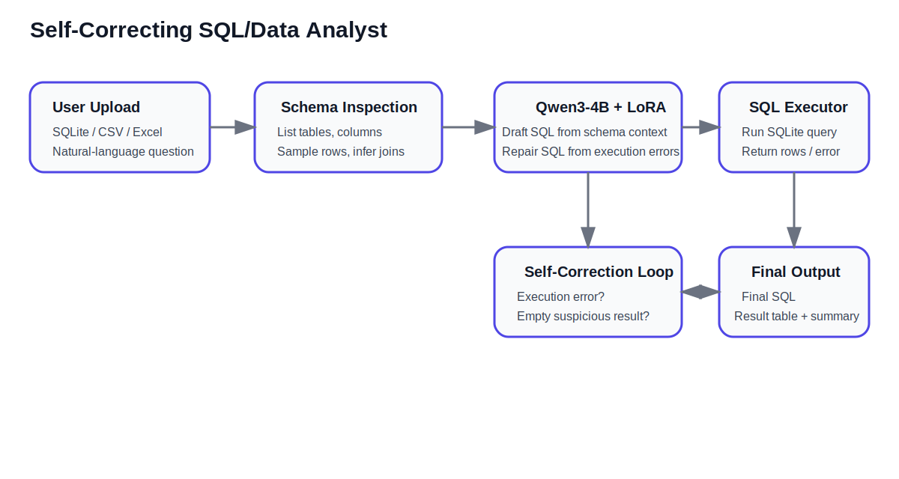

# Self-Correcting SQL/Data Analyst

A GitHub-ready version of the SQL analyst project: a fine-tuned Qwen3-based text-to-SQL system that works over uploaded SQLite / CSV / Excel data, generates SQL, executes it, retries on failures, and returns the final SQL, result table, and agent trace.

## Links

- Live Demo: `REPLACE_WITH_YOUR_HF_SPACE_URL`
- Model Adapter: `REPLACE_WITH_YOUR_HF_MODEL_REPO_URL`
- Kaggle Training Notebook: `REPLACE_WITH_YOUR_KAGGLE_NOTEBOOK_URL`

## What this project does

- Accepts uploaded `.db`, `.sqlite`, `.csv`, `.xlsx`, or `.xls` files
- Converts CSV / Excel to SQLite for a unified execution path
- Inspects schema, columns, sample rows, and join hints
- Generates read-only SQLite SQL from a natural-language business question
- Executes SQL, retries on errors or suspicious empty results, and returns the final answer

## Architecture



## Self-correcting / agentic loop

1. Load user-provided structured data
2. Build compact schema context
3. Draft SQL with the LoRA-adapted Qwen model
4. Execute SQL against SQLite
5. If execution fails or results are suspiciously empty, repair and retry
6. Return final SQL, table output, and trace

## Training setup

- Base model: `Qwen/Qwen3-4B-Instruct-2507`
- Fine-tuning: QLoRA / PEFT on Kaggle
- Benchmark training data: Spider-style text-to-SQL
- Product demo: uploaded database / CSV / Excel + execution-based self-correction

## Repository structure

```text
self-correcting-sql-data-analyst/
├── README.md
├── app.py
├── pyproject.toml
├── requirements.txt
├── architecture_diagram.svg
├── notebook/
├── artifacts/
├── screenshots/
└── src/sql_data_analyst/
```

## Setup

```bash
pip install -r requirements.txt
export SQL_AGENT_BASE_MODEL=Qwen/Qwen3-4B-Instruct-2507
export SQL_AGENT_ADAPTER=your-username/your-adapter-repo
python app.py
```

## Hugging Face Space

For Spaces, set these variables/secrets:

- `SQL_AGENT_BASE_MODEL`
- `SQL_AGENT_ADAPTER`
- `HF_TOKEN` (optional, recommended)

## Metrics

Replace this section with the values from your Kaggle `metrics.json`.

```json
REPLACE_WITH_YOUR_METRICS_JSON
```

## Example output

Replace this with a good `sample_report.json` example from Kaggle.

```json
REPLACE_WITH_YOUR_SAMPLE_REPORT_JSON
```

## Screenshots

Add screenshots to `screenshots/` and embed them here. Good options:

- Space home page
- Good query result
- Retry / self-correction trace
- Uploaded CSV / Excel example
- Architecture diagram

## Future improvements

- Better join inference for multi-table uploads
- Chart generation from result tables
- Safer SQL validation and richer error handling
- Stronger benchmark evaluation beyond exact-match SQL
